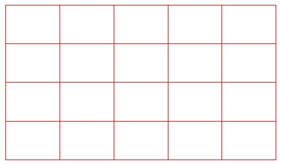
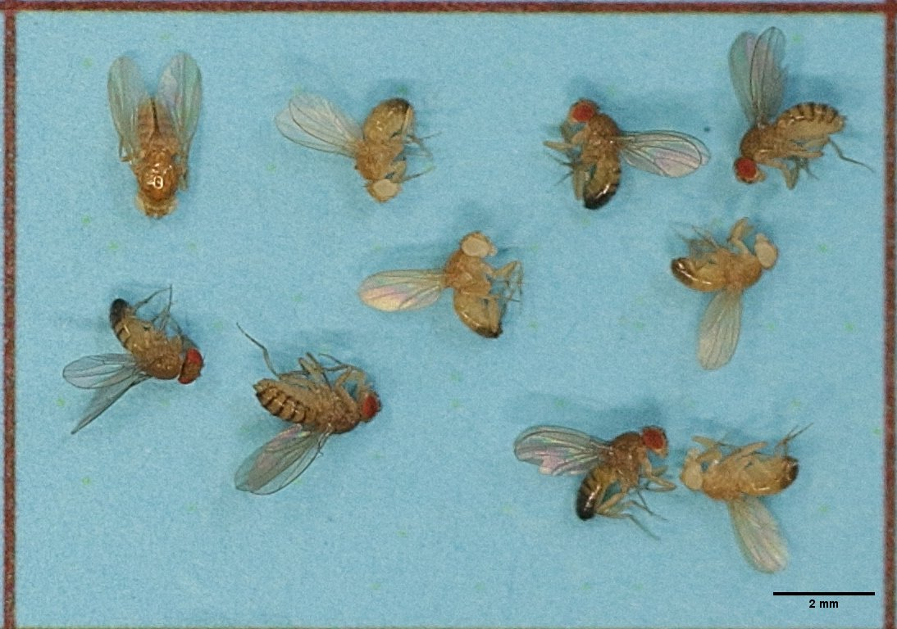
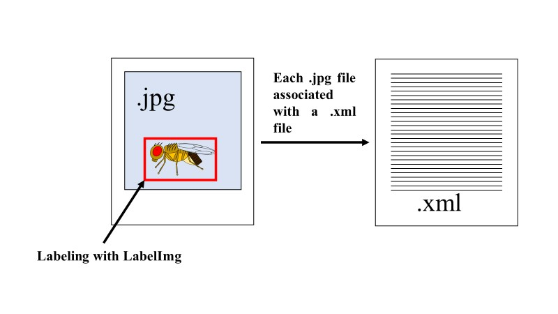
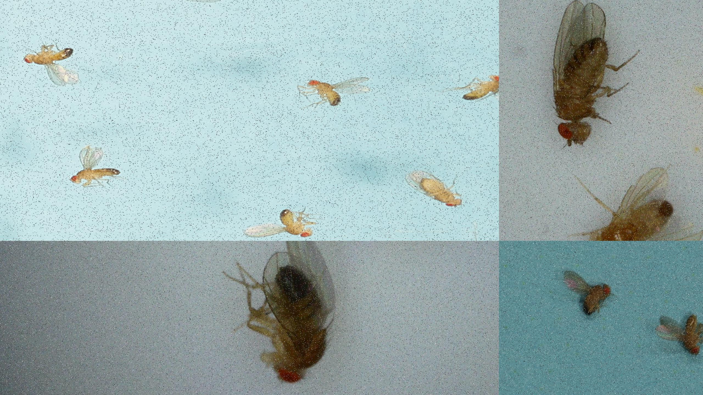

# First Steps

## What is Google Colab?

Google Colab works by allowing users to write and execute Python code in a Jupyter notebook environment hosted on the cloud. It provides free access to computing resources, including CPUs, GPUs, and TPUs, which can significantly accelerate computational tasks. Users can create, share, and collaborate on notebooks in real-time, making it an excellent tool for educational purposes, data analysis, machine learning, and research. Colab also integrates seamlessly with Google Drive, enabling easy saving and sharing of projects.

## How do I access Google Colab?

The first thing is to have a Google account, and to access Google Colab, it's as simple as opening a web browser, going to <https://colab.google/>, and clicking the "Open Colab" button. This will open a new page where you can create a new Google Colab document.

## What is Tensorflow?

TensorFlow is an open-source machine learning framework developed by Google. It allows users to build and train various machine learning models, ranging from simple to complex, using computational graphs. TensorFlow is widely used for tasks such as classification, regression, neural networks, and more, across different platforms and devices.

# Training a TensorFlow model in Google Colab

Next, we will explain how to train a TensorFlow model in Google Colab to detect objects, specifically distinguishing between wild-type flies and white-type flies. Also, in the following sections, datasets will be provided for labeling or a dataset already labeled and ready to be uploaded to Drive and used for training.

## Dataset preparation

First of all, you need a set of photographs that include the flies. To capture the pictures, we used a Bysameyee 8-SA-00 digital microscope, which provides more detailed photos. Additionally, we used a Canon EOS 70D camera with a 100mm macro objective f/2.8L lens in the experiment. We also used cardboard of different colors as backgrounds, which helped to improve accuracy. The images from the Canon camera were quite large and couldn't be processed by the model, so they were divided into equally sized fragments using a Python code and the photographs were taken on a printed grid:

{width="552"}

{width="552"}

``` python
import image_slicer
from PIL import Image
path = "" # add the full path of the image
n = 20 # number of pieces
image_slicer.slice(path, n)
```

The captured images in this format, which can be used for the tutorial, are available at the following link:

[drosophila_dataset](https://github.com/AaronGS1999/Drosophila_AI_Tensorflow/tree/9eeaae8ef404b722e6c874bfb10421835c86281b/images/drosophila_images_v5)

After this, the images will be divided into three different folders using another Python code:

``` python
import splitfolders
folder = "" # Add the address of your folders
splitfolders.ratio(folder, output="output", seed=1999, ratio=(.8, 0.1, 0.1))
```

This code will divide the images into 3 folders: 80% of the total images will be used for training the model, 10% for validation during training, and 10% will be reserved for external checks.

## Labeling

The last step in dataset preparation was to define what the AI needed to learn. This was done using the open-source program LabelImage (<https://github.com/tzutalin/labelImg>). The program allows flies to be labeled and classified as wild type or white type in a graphical interface. An .xml file is generated in pascal voc format, which records the label and coordinates of the flies in the image. This labeling process is done for all images in the training and validation folders.



## Increased training efficiency (optional but strongly recommended):

To enhance the training performance, two techniques were applied to the dataset using the roboflow web platform ([https://roboflow.com](https://roboflow.com/)). The first technique involved automatically combining image fragments to improve the detection of small targets. The second technique involved artificially introducing noise into the photos to enhance their resilience to photo artifacts. An example of this is the following image with 5% noise.



To follow the tutorial, you can use the following labeled dataset:

[labeled_drosophila_dataset](https://www.google.com/url?q=https%3A%2F%2Fdrive.google.com%2Ffile%2Fd%2F1ftwAVHFSc5U7Qbph5NYCqZL7h1Yp6J5m%2Fview%3Fusp%3Dsharing)

## Google Colab preparation for training models

In the following link, there is already a [Google Colab](https://colab.research.google.com/drive/1SdoGigd8u9fq0PAgp6AqXftFHUAuaNqb?usp=sharing) prepared to train Tensorflow models, but here we will explain it step by step.

The first step is to change the runtime type because we will need to use a GPU. To do this, click on Runtime \> Change runtime type at the top, and a menu will open where you can select a GPU.

### Mount google drive on Google Colab notebook

In a code block, you should add the following lines:

``` python
from google.colab import drive
drive.mount("/content/gdrive")
```

When you run this code block with the play button, it will ask for some permissions, and after granting them, you will have a connection between the Google Colab notebook and Drive. Finally, we connect to Google's resources by clicking the connect button.

### Virtual environment preparation

When connecting to the environment, Google Colab already has numerous libraries loaded for both Python and R. However, in our case, to avoid conflicts between packages, we are going to create a virtual environment using Miniconda. To do this, we need to add the following lines to a code block and execute it:

``` python
%env PYTHONPATH = # /env/python
!wget https://repo.anaconda.com/miniconda/Miniconda3-py38_4.12.0-Linux-x86_64.sh
!chmod +x Miniconda3-py38_4.12.0-Linux-x86_64.sh
!./Miniconda3-py38_4.12.0-Linux-x86_64.sh -b -f -p /usr/local
!conda update conda -y
import sys
sys.path.append('/usr/local/lib/python3.8/site-packages')
!conda create -n tensorflowenv python=3.8 -y
```

This will create a virtual environment called `tensorflowenv` with Python 3.8. Next, in another code block, we will insert the necessary packages and install them by running the code cell:

``` python
%%shell
eval "$(conda shell.bash hook)"
conda activate tensorflowenv
pip install tflite-model-maker==0.3.4 tflite-support==0.3.1 tensorflow==2.6.0 keras==2.6.0 tensorflow-estimator==2.6.0 ipykernel pycocotools
conda install -c conda-forge cudatoolkit=11.2 cudnn=8.1.0 -y
```

Although the package versions are old, they are the ones we have tested and confirmed to work.

### Generating the Python script and execute it

To generate the Python script, in a cell we will include the following lines of code for Import of necessary libraries:

``` python
%%writefile  training.py
import numpy as np
import os


from tflite_model_maker.config import ExportFormat, QuantizationConfig
from tflite_model_maker import model_spec
from tflite_model_maker import object_detector

from tflite_support import metadata

import tensorflow as tf
assert tf.__version__.startswith('2')

tf.get_logger().setLevel('ERROR')
from absl import logging
logging.set_verbosity(logging.ERROR)
```

Using `%%writefile training.py` creates a temporary script named `traing.py`.

Continuing with the script, we add the remaining lines of code that will perform the training, pre-exportation validation, and post-exportation validation of the model:

``` python
%%writefile  -a training.py
# pathways and name of tensorflow lite model
training_path = "/content/gdrive/MyDrive/drosophila_white_wild_v7_V2/training"
validation_path ="/content/gdrive/MyDrive/drosophila_white_wild_v7_V2/validation"
tflite_filename="drosophila_lite2_epochs120_batch16_img1251_wild_white_v7_V2.tflite"

# Selecting the model architecture
spec = model_spec.get('efficientdet_lite2')

# data upload
training_data = object_detector.DataLoader.from_pascal_voc(
    training_path,
    training_path,
    ["white type", "wild type"]
)
validation_data = object_detector.DataLoader.from_pascal_voc(
    validation_path,
    validation_path,
    ["white type", "wild type"]
)


# Training
model = object_detector.create(training_data, model_spec=spec, epochs=120, batch_size=16, train_whole_model=True, validation_data=validation_data)

# Export model
model.export(export_dir=".", tflite_filename=tflite_filename)


# Model evaluation
print( model.evaluate(validation_data))

# Exported model evaluation
print(model.evaluate_tflite(tflite_filename, validation_data))
```

Using `%%writefile -a training.py` adds the remaining lines of code to the temporary script.

In Google Drive, you should have the folders specified in this part of the code with the dataset:

``` python
training_path = "/content/gdrive/MyDrive/drosophila_white_wild_v7_V2/training"
validation_path ="/content/gdrive/MyDrive/drosophila_white_wild_v7_V2/validation"
```

The variable `tflite_filename` refers to the name that the trained model will have.

The part of the code where the architecture to be trained is specified is:

``` python
# Selecting the model architecture
spec = model_spec.get('efficientdet_lite2')
```

There are 5 different types of models, some smaller and faster, and others larger and slower for performing inference. Additionally, the larger ones require more GPU resources:

```{r echo=FALSE}
library(kableExtra) # Para las tablas
model <- c("EfficientDet-Lite0", "EfficientDet-Lite1", "EfficientDet-Lite2", "EfficientDet-Lite3", "EfficientDet-Lite4")
size_mb <- c(4.4, 5.8, 7.2, 11.4, 19.9)
latency_ms <- c(37, 49, 69, 116, 260)
average_precision <- c("25.69%", "30.55%", "33.97%", "37.70%", "41.96%")


df <- data.frame(Model = model, `Size(MB)` = size_mb, `Latency(ms)` = latency_ms, `Average Precision` = average_precision)


df %>%
  kbl(caption = "Types of models") %>% kable_classic(full_width = F, html_font = "Cambria")

```

In this section, the training and validation data are loaded. Here, the labels must match those specified in the labeling section:

``` python
# data upload
training_data = object_detector.DataLoader.from_pascal_voc(
    training_path,
    training_path,
    ["white type", "wild type"]
)
validation_data = object_detector.DataLoader.from_pascal_voc(
    validation_path,
    validation_path,
    ["white type", "wild type"]
)
```

Here, the labels are white type and wild type.

To configure how the training will be performed, the following lines of code must be modified:

``` python
# Training
model = object_detector.create(training_data, model_spec=spec, epochs=120, batch_size=16, train_whole_model=True, validation_data=validation_data)
```

Usually, only the values of the following variables need to be modified:

-   **Epochs:** An epoch refers to one complete cycle through the entire training dataset. During training, the model processes all the training data once per epoch. Multiple epochs are often used to improve the model’s performance, as each epoch allows the model to learn and adjust its parameters based on the data.

-   **Batch Size**: Batch size is the number of training examples utilized in one iteration of training. Instead of processing the entire dataset at once, the training data is divided into smaller batches, and the model updates its parameters after each batch. A smaller batch size typically requires more iterations to complete one epoch, while a larger batch size reduces the number of iterations but requires more memory.

In the section of the code detailed below, the model is exported and validated before and after being exported:

``` python
# Export model
model.export(export_dir=".", tflite_filename=tflite_filename)


# Model evaluation
print( model.evaluate(validation_data))

# Exported model evaluation
print(model.evaluate_tflite(tflite_filename, validation_data))
```

The training results are analyzed using [COCO metrics](https://cocodataset.org/#detection-eval), which will give us an idea of the object detection accuracy. For this purpose, it uses the images from the validation folder.

In a new code block, we will use the virtual environment tensorflowenv created earlier to execute the temporary script:

``` python
%%shell
eval "$(conda shell.bash hook)"
conda activate tensorflowenv
python3 training.py
```

### Export model

To export the model from Google Colab, you can do it with the following code:

``` python
from google.colab import files
tflite_filename="drosophila_lite2_epochs120_batch16_img1251_wild_white_v7_V2.tflite"
files.download(tflite_filename)
```

The name of the model established previously must match with `tflite_filename`.

## Trained models

Numerous models have been trained with different datasets as can be seen [here](https://github.com/AaronGS1999/Drosophila_AI_Tensorflow/tree/bb9daa4bdf4ee11b76e887b3137faa154f2456af/Trained%20models). However, the five available architectures trained with our most longest dataset are located [here](https://github.com/AaronGS1999/Drosophila_AI_Tensorflow/tree/bb9daa4bdf4ee11b76e887b3137faa154f2456af/best%20models). The metrics for these can be seen [here](https://github.com/AaronGS1999/Drosophila_AI_Tensorflow/blob/51b1227b677977c161fffda169c258ba2c979107/results/COCO_metrics.xlsx).

# Image processing with pre-trained tensorflow model

In the following link, there is already a [Google Colab](https://colab.research.google.com/drive/1yYFuL3nnxHVXfjSvsRz-pFrDTsFPO2Y7?usp=sharing) prepared to to process images with Tensorflow models, but here we will explain it step by step.

## Drive preparation

For the correct operation it is necessary that you have a folder called 'Image_Processing_Approach' in your google drive with the image you want to process and the trained model.

For example, you can use the following image:


And one of the trained models such as [drosophila_lite2_epochs120_batch16_img1251_wild_white_v7_V2.tflite](https://github.com/AaronGS1999/Drosophila_AI_Tensorflow/blob/128990882b9712df3c54cc6853f475752aa4a1fb/best%20models/drosophila_lite2_epochs120_batch16_img1251_wild_white_v7_V2.tflite)

## Google Colab preparation for image processing with a tensorflow model

### Mount google drive on Google Colab notebook

In a code block, you should add the following lines:

``` python
from google.colab import drive
drive.mount("/content/gdrive")
```

### Virtual environment preparation

When connecting to the environment, Google Colab already has numerous libraries loaded for both Python and R. However, in our case, to avoid conflicts between packages, we are going to create a virtual environment using Miniconda. To do this, we need to add the following lines to a code block and execute it:

``` python
%env PYTHONPATH = # /env/python
!wget https://repo.anaconda.com/miniconda/Miniconda3-py38_4.12.0-Linux-x86_64.sh
!chmod +x Miniconda3-py38_4.12.0-Linux-x86_64.sh
!./Miniconda3-py38_4.12.0-Linux-x86_64.sh -b -f -p /usr/local
!conda update conda -y
import sys
sys.path.append('/usr/local/lib/python3.8/site-packages')
!conda create -n tensorflowenv python=3.8 -y
```

This will create a virtual environment called `tensorflowenv` with Python 3.8. Next, in another code block, we will insert the necessary packages and install them by running the code cell:

``` python
%%shell
eval "$(conda shell.bash hook)"
conda activate tensorflowenv
pip install tflite-model-maker==0.3.4 tflite-support==0.3.1 tensorflow==2.6.0 keras==2.6.0 tensorflow-estimator==2.6.0 image-slicer
pip uninstall opencv-python-headless -y
pip install opencv-contrib-python-headless==4.5.4.60
conda install -c conda-forge cudatoolkit=11.2 cudnn=8.1.0 -y
```

### Generating the Python script and execute it

To generate the Python script, in a cell we will include the following lines of code for Import of necessary libraries:

``` python
%%writefile  drosophilatensorflow.py
# Required libraries
import os
import errno
import time
import numpy as np
from numpy import RAISE
import cv2
from tflite_support import metadata
import tensorflow as tf
import platform
from typing import List, NamedTuple
import json
from PIL import Image
import pandas as pd
import image_slicer
from pathlib import Path

Interpreter =tf.lite.Interpreter
load_delegate = tf.lite.experimental.load_delegate
selec = 0
```

Using `%%writefile  drosophilatensorflow.py` creates a temporary script named `drosophilatensorflow.py`. The remaining parts of the code will be added to the temporary script sequentially.

The next step is to add the lines of code with the paths to the Drive files to the temporary script:

``` python
%%writefile -a drosophilatensorflow.py
path_folder = "/content/gdrive/MyDrive/Image_Processing_Approach"
path_folder2 = "/content/gdrive/MyDrive/Image_Processing_Approach/processed"
INPUT_IMAGENAME = "/01.JPG"
cont = 21
```

cont is a necessary variable to fragment the image. If you don't have those same paths on Drive, you'll need to modify them.

In the following part of the code, you should specify the path to the pretrained model, and a dataframe will be generated to store the results in a .csv file.

``` python
%%writefile -a drosophilatensorflow.py

# Wild/White
TFLITE_MODEL_PATH = "/content/gdrive/MyDrive/Image_Processing_Approach/drosophila_lite2_epochs120_batch16_img1251_wild_white_v7_V2.tflite"
selec = 1
dataframe = pd.DataFrame(columns=["IMAGE_NAME", "WILD", "WHITE"])
```

The next part of the code is extensive and may be complex. Essentially, it includes the necessary variables and the classes that define the functionalities:

``` python
# @title variables and classes
%%writefile -a drosophilatensorflow.py

# Required variables
bucle_while = True
wildtypecount = 0
whitetypecount = 0
imagewildtypecount = 0
imagewhitetypecount = 0
femalecount = 0
malecount = 0
imagefemalecount = 0
imagemalecount = 0
femalewildcount = 0
malewildcount = 0
femalewhitecount = 0
malewhitecount = 0
imagefemalewildcount = 0
imagemalewildcount = 0
imagefemalewhitecount = 0
imagemalewhitecount = 0
counter1 = 1
counter2 = 1
# required classes
class ObjectDetectorOptions(NamedTuple):


  enable_edgetpu: bool = False


  label_allow_list: List[str] = None


  label_deny_list: List[str] = None


  max_results: int = -1


  num_threads: int = 1


  score_threshold: float = 0.0


class Rect(NamedTuple):
  left: float
  top: float
  right: float
  bottom: float


class Category(NamedTuple):
  label: str
  score: float
  index: int


class Detection(NamedTuple):
  bounding_box: Rect
  categories: List[Category]


def edgetpu_lib_name():
  return {
      'Darwin': 'libedgetpu.1.dylib',
      'Linux': 'libedgetpu.so.1',
      'Windows': 'edgetpu.dll',
  }.get(platform.system(), None)


class ObjectDetector:
  _OUTPUT_LOCATION_NAME = 'location'
  _OUTPUT_CATEGORY_NAME = 'category'
  _OUTPUT_SCORE_NAME = 'score'
  _OUTPUT_NUMBER_NAME = 'number of detections'

  def __init__(
      self,
      model_path: str,
      options: ObjectDetectorOptions = ObjectDetectorOptions()
  ) -> None:

    # Load metadata from model.
    displayer = metadata.MetadataDisplayer.with_model_file(model_path)

    # Save model metadata for preprocessing later.
    model_metadata = json.loads(displayer.get_metadata_json())
    process_units = model_metadata['subgraph_metadata'][0]['input_tensor_metadata'][0]['process_units']
    mean = 0.0
    std = 1.0
    for option in process_units:
      if option['options_type'] == 'NormalizationOptions':
        mean = option['options']['mean'][0]
        std = option['options']['std'][0]
    self._mean = mean
    self._std = std

    # Load label list from metadata.
    file_name = displayer.get_packed_associated_file_list()[0]
    label_map_file = displayer.get_associated_file_buffer(file_name).decode()
    label_list = list(filter(lambda x: len(x) > 0, label_map_file.splitlines()))
    self._label_list = label_list

    # Initialize TFLite model.
    if options.enable_edgetpu:
      if edgetpu_lib_name() is None:
        raise OSError("The current OS isn't supported by Coral EdgeTPU.")
      interpreter = Interpreter(
          model_path=model_path,
          experimental_delegates=[load_delegate(edgetpu_lib_name())],
          num_threads=options.num_threads)
    else:
      interpreter = Interpreter(
          model_path=model_path, num_threads=options.num_threads)

    interpreter.allocate_tensors()
    input_detail = interpreter.get_input_details()[0]

    sorted_output_indices = sorted(
        [output['index'] for output in interpreter.get_output_details()])
    self._output_indices = {
        self._OUTPUT_LOCATION_NAME: sorted_output_indices[0],
        self._OUTPUT_CATEGORY_NAME: sorted_output_indices[1],
        self._OUTPUT_SCORE_NAME: sorted_output_indices[2],
        self._OUTPUT_NUMBER_NAME: sorted_output_indices[3],
    }

    self._input_size = input_detail['shape'][2], input_detail['shape'][1]
    self._is_quantized_input = input_detail['dtype'] == np.uint8
    self._interpreter = interpreter
    self._options = options

  def detect(self, input_image: np.ndarray) -> List[Detection]:
    image_height, image_width, _ = input_image.shape

    input_tensor = self._preprocess(input_image)

    self._set_input_tensor(input_tensor)
    self._interpreter.invoke()

    # Get all output details
    boxes = self._get_output_tensor(self._OUTPUT_LOCATION_NAME)
    classes = self._get_output_tensor(self._OUTPUT_CATEGORY_NAME)
    scores = self._get_output_tensor(self._OUTPUT_SCORE_NAME)
    count = int(self._get_output_tensor(self._OUTPUT_NUMBER_NAME))

    return self._postprocess(boxes, classes, scores, count, image_width,
                             image_height)

  def _preprocess(self, input_image: np.ndarray) -> np.ndarray:

    # Resize the input
    input_tensor = cv2.resize(input_image, self._input_size)

    # Normalize the input if it's a float model (aka. not quantized)
    if not self._is_quantized_input:
      input_tensor = (np.float32(input_tensor) - self._mean) / self._std

    # Add batch dimension
    input_tensor = np.expand_dims(input_tensor, axis=0)

    return input_tensor

  def _set_input_tensor(self, image):
    tensor_index = self._interpreter.get_input_details()[0]["index"]
    input_tensor = self._interpreter.tensor(tensor_index)()[0]
    input_tensor[:, :] = image

  def _get_output_tensor(self, name):
    output_index = self._output_indices[name]
    tensor = np.squeeze(self._interpreter.get_tensor(output_index))
    return tensor

  def _postprocess(self, boxes: np.ndarray, classes: np.ndarray,
                   scores: np.ndarray, count: int, image_width: int,
                   image_height: int) -> List[Detection]:
    results = []

    # Parse the model output into a list of Detection entities.
    for i in range(count):
      if scores[i] >= self._options.score_threshold:
        y_min, x_min, y_max, x_max = boxes[i]
        bounding_box = Rect(
            top=int(y_min * image_height),
            left=int(x_min * image_width),
            bottom=int(y_max * image_height),
            right=int(x_max * image_width))
        class_id = int(classes[i])
        category = Category(
            score=scores[i],
            label=self._label_list[class_id],  # 0 is reserved for background
            index=class_id)
        result = Detection(bounding_box=bounding_box, categories=[category])
        results.append(result)

    # Sort detection results by score ascending
    sorted_results = sorted(
        results,
        key=lambda detection: detection.categories[0].score,
        reverse=True)

    # Filter out detections in deny list
    filtered_results = sorted_results
    if self._options.label_deny_list is not None:
      filtered_results = list(
          filter(
              lambda detection: detection.categories[0].label not in self.
              _options.label_deny_list, filtered_results))

    # Keep only detections in allow list
    if self._options.label_allow_list is not None:
      filtered_results = list(
          filter(
              lambda detection: detection.categories[0].label in self._options.
              label_allow_list, filtered_results))

    # Only return maximum of max_results detection.
    if self._options.max_results > 0:
      result_count = min(len(filtered_results), self._options.max_results)
      filtered_results = filtered_results[:result_count]

    return filtered_results


_MARGIN = 20  # pixels
_ROW_SIZE =20  # pixels
_FONT_SIZE = 1
_FONT_THICKNESS = 1
_TEXT_COLOR = (255, 0, 0)  # red


def visualize(
    image: np.ndarray,
    detections: List[Detection],
) -> np.ndarray:
  global dataframe
  if selec == 1:
    for detection in detections:
      # Draw bounding_box
      start_point = detection.bounding_box.left, detection.bounding_box.top
      end_point = detection.bounding_box.right, detection.bounding_box.bottom
      cv2.rectangle(image, start_point, end_point, _TEXT_COLOR, 3)

      # Draw label and score
      category = detection.categories[0]
      class_name = category.label

      # detection count
      if class_name == "wild type":
        global imagewildtypecount
        global wildtypecount
        wildtypecount = wildtypecount + 1
        imagewildtypecount = imagewildtypecount + 1
      if class_name == "white type":
        global whitetypecount
        global imagewhitetypecount
        whitetypecount = whitetypecount + 1
        imagewhitetypecount = imagewhitetypecount + 1
      probability = round(category.score, 2)
      result_text = class_name + ' (' + str(probability) + ')'
      text_location = (_MARGIN + detection.bounding_box.left,
                      _MARGIN + _ROW_SIZE + detection.bounding_box.top)
      cv2.putText(image, result_text, text_location, cv2.FONT_HERSHEY_PLAIN,
                  _FONT_SIZE, _TEXT_COLOR, _FONT_THICKNESS)
    new_line = {"IMAGE_NAME":name_photo, "WILD":imagewildtypecount, "WHITE":imagewhitetypecount}
    dataframe = dataframe.append(new_line, ignore_index=True)
    imagewildtypecount = 0
    imagewhitetypecount = 0

  if selec == 2:
    for detection in detections:
      # Draw bounding_box
      start_point = detection.bounding_box.left, detection.bounding_box.top
      end_point = detection.bounding_box.right, detection.bounding_box.bottom
      cv2.rectangle(image, start_point, end_point, _TEXT_COLOR, 3)

      # Draw label and score
      category = detection.categories[0]
      class_name = category.label

      # detection count
      if class_name == "female":
        global imagefemalecount
        global femalecount
        femalecount =  femalecount + 1
        imagefemalecount = imagefemalecount + 1
      if class_name == "male":
        global malecount
        global imagemalecount
        malecount = malecount + 1
        imagemalecount = imagemalecount + 1
      probability = round(category.score, 2)
      result_text = class_name + ' (' + str(probability) + ')'
      text_location = (_MARGIN + detection.bounding_box.left,
                      _MARGIN + _ROW_SIZE + detection.bounding_box.top)
      cv2.putText(image, result_text, text_location, cv2.FONT_HERSHEY_PLAIN,
                  _FONT_SIZE, _TEXT_COLOR, _FONT_THICKNESS)
    new_line = {"IMAGE_NAME":name_photo, "FEMALE":imagefemalecount, "MALE":imagemalecount}
    dataframe = dataframe.append(new_line, ignore_index=True)
    imagefemalecount = 0
    imagemalecount = 0

  if selec == 3:
    for detection in detections:
      # Draw bounding_box
      start_point = detection.bounding_box.left, detection.bounding_box.top
      end_point = detection.bounding_box.right, detection.bounding_box.bottom
      cv2.rectangle(image, start_point, end_point, _TEXT_COLOR, 3)

      # Draw label and score
      category = detection.categories[0]
      class_name = category.label

      # detection count
      if class_name == "female wild type":
        global imagefemalewildcount
        global femalewildcount
        femalewildcount =  femalewildcount + 1
        imagefemalewildcount = imagefemalewildcount + 1

      if class_name == "male wild type":
        global malewildcount
        global imagemalewildcount
        malewildcount = malewildcount + 1
        imagemalewildcount = imagemalewildcount + 1

      if class_name == "female white type":
        global imagefemalewhitecount
        global femalewhitecount
        femalewhitecount =  femalewhitecount + 1
        imagefemalewhitecount = imagefemalewhitecount + 1

      if class_name == "male white type":
        global malewhitecount
        global imagemalewhitecount
        malewhitecount = malewhitecount + 1
        imagemalewhitecount = imagemalewhitecount + 1
      probability = round(category.score, 2)
      result_text = class_name + ' (' + str(probability) + ')'
      text_location = (_MARGIN + detection.bounding_box.left,
                      _MARGIN + _ROW_SIZE + detection.bounding_box.top)
      cv2.putText(image, result_text, text_location, cv2.FONT_HERSHEY_PLAIN,
                  _FONT_SIZE, _TEXT_COLOR, _FONT_THICKNESS)
    new_line = {"IMAGE_NAME":name_photo, "FEMALE_WILD":imagefemalewildcount, "MALE_WILD":imagemalewildcount, "FEMALE_WHITE":imagefemalewhitecount, "MALE_WHITE":imagemalewhitecount}
    dataframe = dataframe.append(new_line, ignore_index=True)
    imagefemalewildcount = 0
    imagemalewildcount = 0
    imagefemalewhitecount = 0
    imagemalewhitecount = 0

  return image
```

With the following code, you will be able to create the "processed" folder if you haven't created it manually in Google Drive:

``` python
%%writefile -a drosophilatensorflow.py

try:
    os.mkdir(path_folder2)
except OSError as error:
    if error.errno != errno.EEXIST:
        RAISE
```

Finally, the last part of the code is added, which includes splitting the image into 20 pieces, the necessary loops to process each fragment, and ultimately displaying and saving in a csv file the results:

``` python
%%writefile -a drosophilatensorflow.py

# fragment the image
image_slicer.slice(path_folder + INPUT_IMAGENAME, 20)
file_name = Path(path_folder + INPUT_IMAGENAME).stem

# Image processing
for i in range(1, cont ):
    name_photo = file_name +"_0"+ str(counter2)+"_0" + str(counter1) + ".png"
    INPUT_IMAGE = path_folder + "/"+ name_photo
    DETECTION_THRESHOLD = 0.65

    image = Image.open(INPUT_IMAGE).convert('RGB')
    #image.thumbnail((512, 512), Image.ANTIALIAS)
    image_np = np.asarray(image)
    # Load the TFLite model
    options = ObjectDetectorOptions(
        num_threads=4,
        score_threshold=DETECTION_THRESHOLD,
    )
    detector = ObjectDetector(model_path=TFLITE_MODEL_PATH, options=options)

    # Run object detection estimation using the model.
    detections = detector.detect(image_np)

    # Draw keypoints and edges on input image
    image_np = visualize(image_np, detections)
    # Save the detection result
    im = Image.fromarray(image_np)
    im.save(path_folder2 + "/" + name_photo)
    print("processed image "+str(i)+" of "+ str(cont - 1))
    counter1 = counter1 +1
    if counter1 == 6:
        counter2 = counter2 +1
        counter1 = 1

# show results
if selec == 1:
  print("The total number of wild types detected has been: " + str(wildtypecount))
  print("The total number of white type detected has been: "+ str(whitetypecount))

if selec == 2:
  print("The total number of females detected has been: " + str(femalecount))
  print("The total number of males detected has been: "+ str(malecount))

if selec == 3:
  print("The total number of females wild type detected has been: " + str(femalewildcount))
  print("The total number of males wild type detected has been: "+ str(malewildcount))
  print("The total number of females white type detected has been: " + str(femalewhitecount))
  print("The total number of males detected white type has been: "+ str(malewhitecount))
# save results
dataframe.to_csv("drosophila_output.csv")
```

To execute the code, the virtual environment is used as follows:

``` python
%%shell
eval "$(conda shell.bash hook)"
conda activate tensorflowenv
python3 drosophilatensorflow.py
```

### Rebuild the image with the processed fragments

Reconstructing the image with the processed fragments can be interesting and useful. This can be done with the following code:

``` python
%%writefile rebuild.py

import image_slicer

# should be the same as in the previous section
path_folder2 = "/content/gdrive/MyDrive/Image_Processing_Approach/processed"

tiles = image_slicer.open_images_in(path_folder2)
image = image_slicer.join(tiles)
image.save(path_folder2+"/reconstructed_image.png")
```

To execute the code, the virtual environment is used as follows:

``` python
%%shell
eval "$(conda shell.bash hook)"
conda activate tensorflowenv
python3 rebuild.py
```

This will generate an image like this:


To view the content of the CSV file in Google Colab, you can use the following lines of code:

``` python
import pandas as pd
pd.read_csv("drosophila_output.csv")
```

To download the CSV file you can run the next code:

``` python
from google.colab import files
files.download("drosophila_output.csv")
```

To download the processed images, you can use the following code:

``` python
!cp -r /content/gdrive/MyDrive/Image_Processing_Approach/processed /content/
!zip -r processed.zip /content/processed
```

And then:

``` python
files.download("/content/processed.zip")
```

### Restore starting point

Usually, you will not process just one image, and to avoid repeating the execution of all the cells and manually deleting the images from Google Drive, you can use the following code:

``` python
%%writefile restore.py
import os
from pathlib import Path
# should be the same as in the previous section
path_folder = "/content/gdrive/MyDrive/Image_Processing_Approach"
path_folder2 = "/content/gdrive/MyDrive/Image_Processing_Approach/processed"
INPUT_IMAGENAME = "/01.JPG"
file_name = Path(path_folder + INPUT_IMAGENAME).stem
cont = 21
counter1 = 1
counter2 = 1
os.remove(path_folder2+"/reconstructed_image.png")
for i in range(1, cont ):
    name_photo = file_name + "_0"+ str(counter2)+"_0" + str(counter1) + ".png"
    INPUT_IMAGE = path_folder + "/"+ name_photo
    os.remove(INPUT_IMAGE)
    counter1 = counter1 +1
    if counter1 == 6:
      counter2 = counter2 +1
      counter1 = 1
counter1 = 1
counter2 = 1
for i in range(1, cont ):
    name_photo = file_name + "_0"+ str(counter2)+"_0" + str(counter1) + ".png"
    INPUT_IMAGE = path_folder2 + "/"+ name_photo
    os.remove(INPUT_IMAGE)
    counter1 = counter1 +1
    if counter1 == 6:
      counter2 = counter2 +1
      counter1 = 1
```

And then execute the code with the conda environment:

``` python
%%shell
eval "$(conda shell.bash hook)"
conda activate tensorflowenv
python3 restore.py
```

To process another image, you should place it in Google Drive and execute the collection of temporary scripts that has been built:

1.  To process images:

    ``` python
    %%shell
    eval "$(conda shell.bash hook)"
    conda activate tensorflowenv
    python3 drosophilatensorflow.py
    ```

2.  To reconstruct processed image:

    ``` python
    %%shell
    eval "$(conda shell.bash hook)"
    conda activate tensorflowenv
    python3 rebuild.py
    ```

3.  And to restore Google Drive:

    ``` python
    %%shell
    eval "$(conda shell.bash hook)"
    conda activate tensorflowenv
    python3 restore.py
    ```
